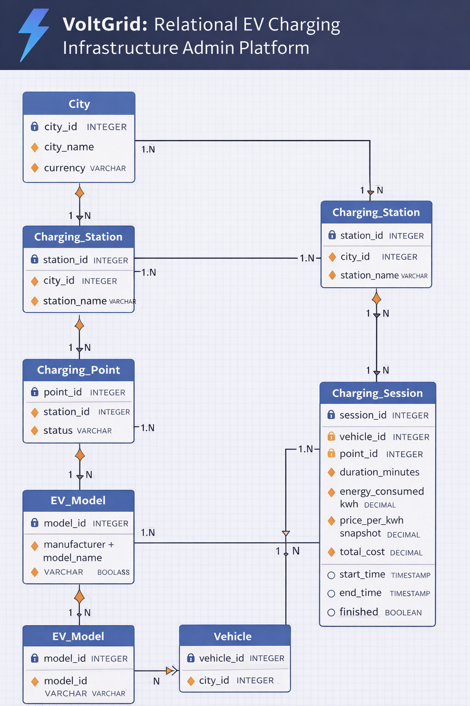
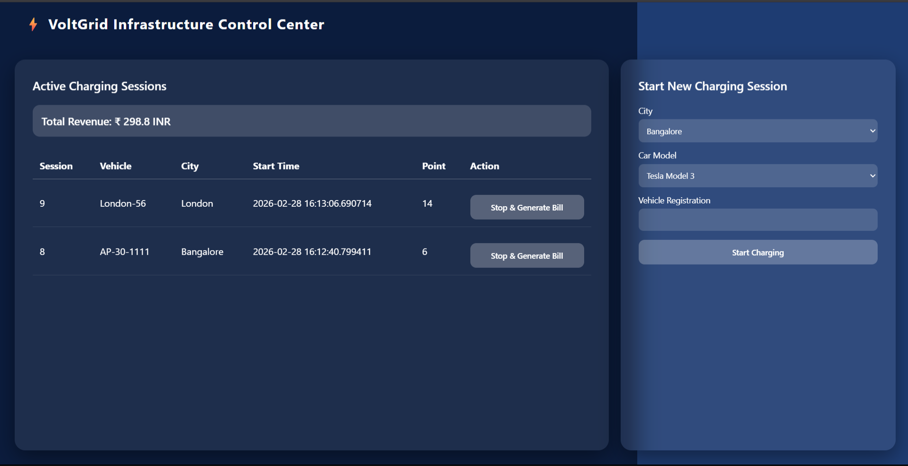
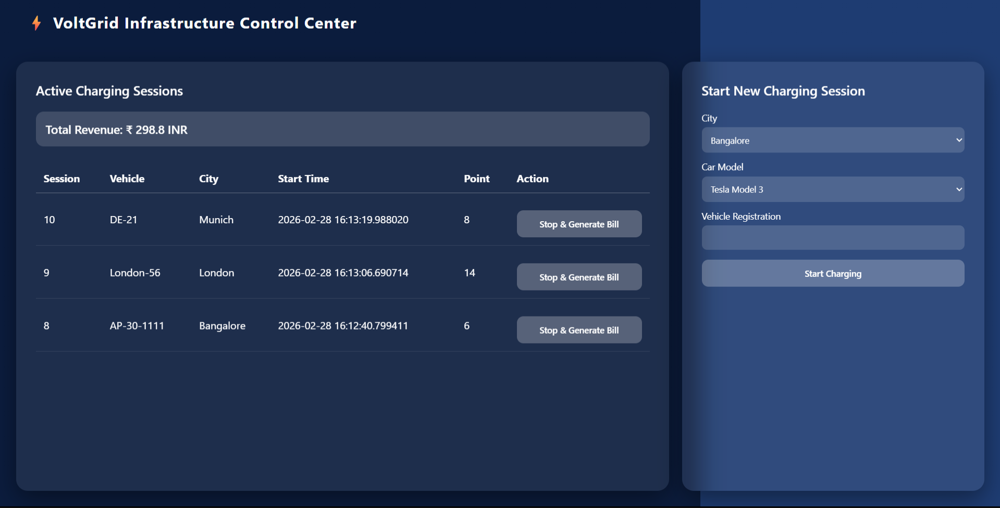
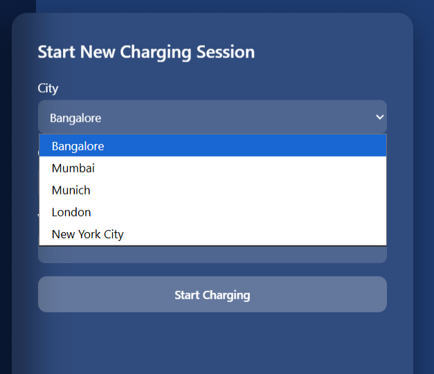
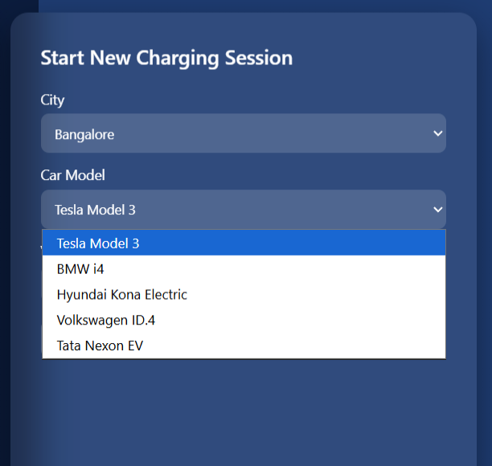
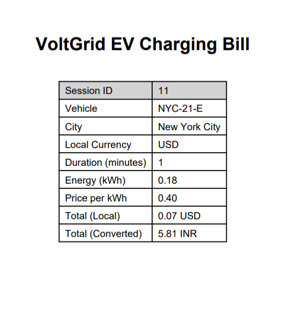
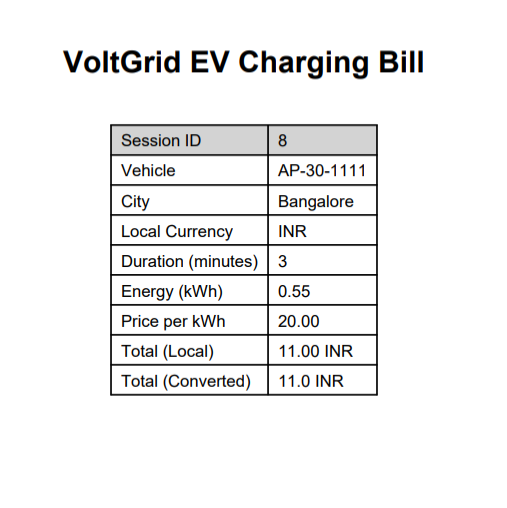
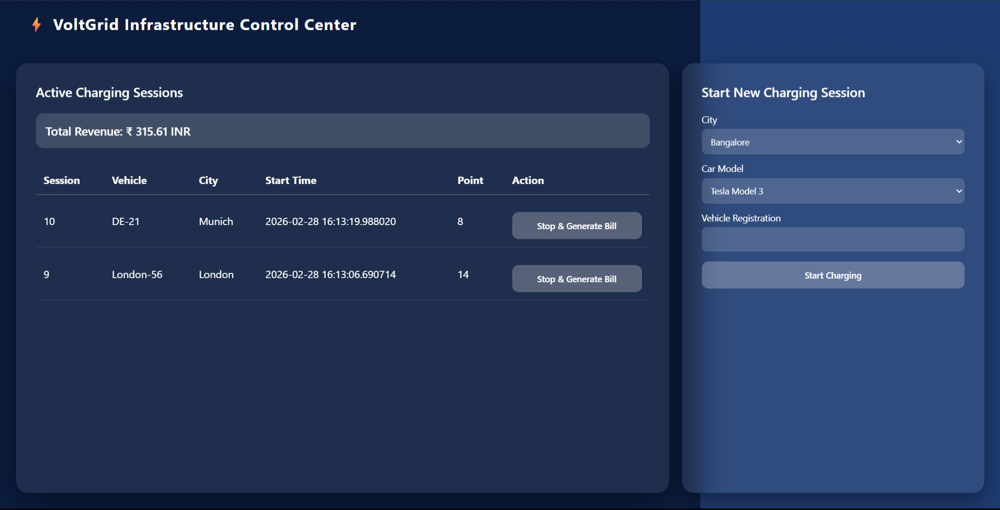
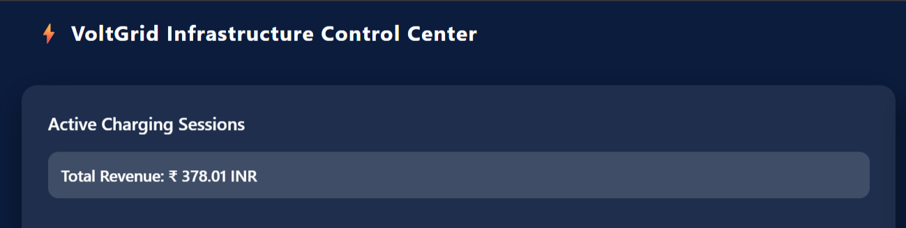

# ⚡ VoltGrid: Relational EV Charging Infrastructure Admin Platform

> A database-driven EV charging infrastructure administration system that simulates a multi-city charging network with concurrent session handling, multi-currency billing, and automated PDF invoice generation.

---

##  Team

 **Mokshagna Ratakonda**
 **Kundan Ratakonda**

---

##  Problem Statement

Electric Vehicle (EV) adoption is growing rapidly across the globe, yet the backend infrastructure required to manage large-scale charging networks — spanning multiple cities, currencies, and concurrent vehicle sessions — remains complex and fragmented.

**VoltGrid** addresses this challenge by building a fully normalized, relational database-backed admin platform that simulates a real-world multi-city EV charging network. The system solves the following core problems:

- **Concurrency Control**: Multiple EVs may attempt to occupy the same charging point simultaneously. Without proper enforcement, this causes double-booking and infrastructure conflicts.
- **Multi-Currency Billing**: Charging stations operate across countries with different currencies (INR, USD, EUR, GBP). Revenue must be aggregated in a unified base currency (INR) for centralized reporting.
- **Session Lifecycle Management**: Each charging session must be reliably started, tracked, stopped, and billed — with accurate energy consumption and duration calculations.
- **Infrastructure Scalability**: The platform must model a hierarchical infrastructure (City → Station → Point → Vehicle → Session) and remain extensible as the network grows.
- **Invoice Generation**: Customers and administrators require itemized PDF bills that show both local currency cost and INR equivalent for transparency.

---

##  System Architecture

```
City
 └── Charging Station (4 per city)
      └── Charging Point (4 per station)
           └── Vehicle
                └── Charging Session
```

Each charging point allows only **one active session at a time**, enforced using a **partial unique index** at the database level — preventing race conditions and double-booking without application-level locking.

---

##  Database Design

### Entity-Relationship Diagram



The ER diagram illustrates the full relational structure of VoltGrid — from `City` down through `Charging_Station`, `Charging_Point`, `EV_Model`, `Vehicle`, and `Charging_Session`. All relationships are one-to-many (1:N), reflecting the strict hierarchical nature of the infrastructure.

### Entities & Schema

| Entity | Key Fields |
|--------|-----------|
| **City** | `city_id`, `name`, `currency`, `price_per_kwh` |
| **Charging_Station** | `station_id` (SERIAL), `city_id` (FK), `name`, `location` |
| **Charging_Point** | `point_id` (SERIAL), `station_id` (FK), `status` (ENUM) |
| **EV_Model** | `model_id`, `manufacturer`, `model_name`, `battery_capacity_kwh` |
| **Vehicle** | `vehicle_id`, `registration`, `model_id` (FK) |
| **Charging_Session** | `session_id`, `point_id` (FK), `vehicle_id` (FK), `start_time`, `end_time`, `energy_kwh`, `cost_local`, `cost_inr` |

### Key Design Decisions

- **Third Normal Form (3NF)**: All tables are fully normalized, eliminating transitive dependencies and data redundancy.
- **Foreign Key Constraints**: Referential integrity is enforced at every level of the hierarchy.
- **ENUM for Status**: Charging point status (`available`, `in_use`, `maintenance`) is stored as a PostgreSQL ENUM for type safety.
- **Partial Unique Index for Concurrency**: A partial index on `(point_id) WHERE end_time IS NULL` ensures no two active sessions can occupy the same point simultaneously.
- **SERIAL Primary Keys**: Both `station_id` and `point_id` are auto-generated using PostgreSQL `SERIAL`, ensuring unique identification without manual key management.

### Stored Procedures

```sql
-- Starts a new charging session, marks point as in_use
CALL start_charging_session(p_point_id, p_vehicle_id);

-- Ends session, calculates energy & cost, marks point as available
CALL stop_charging_session(p_session_id);
```

---

##  Cities & Pricing

| City | Currency | Price per kWh |
|------|----------|---------------|
| Bangalore | INR | ₹20.00 |
| Mumbai | INR | ₹22.00 |
| Munich | EUR | €0.35 |
| London | GBP | £0.30 |
| New York City | USD | $0.40 |

---

##  Supported EV Models

| Manufacturer | Model | Battery Capacity |
|--------------|-------|-----------------|
| Tesla | Model 3 | 75 kWh |
| BMW | i4 | 83.9 kWh |
| Hyundai | Kona Electric | 64 kWh |
| Volkswagen | ID.4 | 77 kWh |
| Tata | Nexon EV | 40.5 kWh |

---

##  Charging Infrastructure

| Metric | Value |
|--------|-------|
| Cities | 5 |
| Stations per City | 4 |
| Charging Points per Station | 4 |
| Total Points per City | 16 |
| **Total Network Charging Points** | **80** |

---

##  Features In Detail

### 1.  Admin Dashboard (70/30 Split UI)

The dashboard is divided into two panels:

- **Left Panel (70%)** — Displays all currently active charging sessions in a live table. Each row shows:
  - Session ID
  - Vehicle registration number
  - City name
  - Session start timestamp
  - Charging Point ID
  - A **"Stop & Generate Bill"** action button

- **Right Panel (30%)** — A form to start a new charging session with:
  - City dropdown (dynamically lists all 5 cities)
  - Car Model dropdown (lists all 5 EV models)
  - Vehicle Registration text input
  - **"Start Charging"** submit button

The UI uses a **glassmorphism design** with a dark navy color scheme, providing a sleek professional aesthetic suited for infrastructure management tools.

---

### 2.  Start Charging Session

When an admin initiates a session:

1. The system looks up or creates the vehicle record based on registration number and selected EV model.
2. An available charging point in the selected city is automatically assigned.
3. The `start_charging_session` stored procedure is called, which:
   - Records the session start timestamp.
   - Sets the charging point status to `in_use`.
   - Inserts the new session row into `Charging_Session`.
4. The dashboard immediately reflects the new active session.

**Concurrency Safety**: If all charging points in a city are occupied, the system returns an appropriate error rather than double-assigning a point — enforced by the partial unique index.

---

### 3.  Stop Charging Session & Bill Generation

When an admin clicks **"Stop & Generate Bill"**:

1. The `stop_charging_session` stored procedure is called, which:
   - Records the `end_time`.
   - Calculates **duration in minutes**.
   - Estimates **energy consumed (kWh)** based on battery capacity and time.
   - Computes **local currency cost** = `energy_kwh × price_per_kwh`.
   - Converts cost to **INR** using static FX rates.
   - Sets charging point status back to `available`.
2. A **PDF bill is automatically generated** and downloaded.

---

### 4.  Multi-Currency Billing Engine

The billing engine handles 4 currencies with static FX conversion to INR:

| Currency | FX Rate to INR |
|----------|---------------|
| INR | 1.0 (base) |
| USD | ~83.5 |
| EUR | ~90.2 |
| GBP | ~105.6 |

Each bill records:
- **Local Currency Cost** (e.g., 0.07 USD, £0.18)
- **INR Equivalent** (e.g., ₹5.81)
- Price per kWh snapshot at time of session (ensures historical accuracy even if rates change)

Revenue displayed on the dashboard is always aggregated in INR for unified reporting.

---

### 5.  Automated PDF Invoice Generation

Each stopped session automatically generates a clean PDF bill containing:

| Field | Description |
|-------|-------------|
| Session ID | Unique identifier |
| Vehicle | Registration number |
| City | Location of the charging session |
| Local Currency | Currency used at that city |
| Duration | Time in minutes |
| Energy (kWh) | Estimated energy consumed |
| Price per kWh | Rate at time of session |
| Total (Local) | Cost in local currency |
| Total (Converted) | INR equivalent |

Bills display **both local currency and INR** for full transparency across international users.

---

### 6.  Live Revenue Tracking

The dashboard header shows a continuously updated **Total Revenue** figure in INR. This value:

- Aggregates all completed sessions across all cities and currencies.
- Converts all foreign currency revenue to INR.
- Updates in real-time as sessions are stopped and billed.
- Reflects cumulative growth as more sessions complete (e.g., ₹298.8 → ₹315.61 → ₹378.01 across screenshots).

---

### 7.  Concurrency Control

The system safely handles simultaneous charging sessions through:

- **Database-level partial unique index**: `CREATE UNIQUE INDEX ON charging_session (point_id) WHERE end_time IS NULL` — prevents two active sessions on the same point at the database level.
- **Multi-session support**: The dashboard correctly displays and manages multiple concurrent sessions across different cities, points, and vehicles simultaneously (e.g., Munich DE-21, London London-56, and Bangalore AP-30-1111 all active at once).

---

##  Admin Dashboard UI

### Tech Stack

| Layer | Technology |
|-------|-----------|
| Backend | Python / Flask |
| Database | PostgreSQL |
| PDF Generation | ReportLab / WeasyPrint |
| Frontend | HTML, CSS (Glassmorphism), JavaScript |
| ORM / DB Driver | psycopg2 |

---

##  Demo Screenshots

### 1️ Active Sessions Dashboard
Two concurrent sessions active — London and Bangalore vehicles charging simultaneously. Total revenue shown as ₹298.8 INR.



---

### 2️ Multiple Concurrent Sessions
Three sessions active across Munich, London, and Bangalore — demonstrating multi-city concurrency support.



---

### 3️ City Dropdown Selection
Admin selects the city to assign the new charging session. All 5 cities (Bangalore, Mumbai, Munich, London, New York City) are listed.



---

### 4️ EV Model Selection
Admin selects the vehicle's EV model from the dropdown. All 5 models are listed (Tesla Model 3, BMW i4, Hyundai Kona Electric, Volkswagen ID.4, Tata Nexon EV).



---

### 5️ Generated Bill — USD → INR (New York City)
Session 11 for vehicle NYC-21-E. Cost was $0.07 USD, converted to ₹5.81 INR.



---

### 6️ Generated Bill — INR Native (Bangalore)
Session 8 for vehicle AP-30-1111. 3-minute session, ₹11.00 INR (no conversion needed).



---

### 7️ Revenue Dashboard After Billing
After stopping the Bangalore session, revenue updates to ₹315.61 INR.



---

### 8️ Revenue Growth
Further sessions stopped — total cumulative revenue grows to ₹378.01 INR, demonstrating the live aggregation.



---

##  Setup & Running

### Prerequisites

- Python 3.10+
- PostgreSQL 14+
- pip packages: `flask`, `psycopg2-binary`, `reportlab`

### Installation

```bash
# Clone the repository
git clone https://github.com/your-repo/voltgrid.git
cd voltgrid

# Install dependencies
pip install -r requirements.txt

# Set up the database
psql -U postgres -f schema.sql
psql -U postgres -f seed_data.sql

# Run the Flask app
python app.py
```

### Access

Open `http://localhost:5000` in your browser to access the VoltGrid Infrastructure Control Center.

---

##  Project Structure

```
voltgrid/
├── app.py                 
├── schema.sql             
├── seed_data.sql                                 
├── templates/
│   └── index.html          
├── static/
│   └── style.css           
├── docs/
│   └── screenshots.png     
└── README.md
```

---

##  Future Enhancements

- Real-time FX rate integration via external currency API
- User authentication and role-based access control
- Historical session analytics and revenue charts
- Mobile-responsive dashboard
- Email delivery of PDF invoices
- Dynamic pricing based on peak/off-peak hours

---
